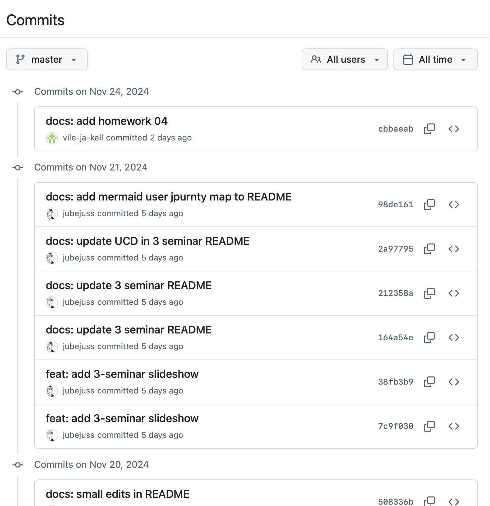

# Githubi õpiraamistik

## Probleem:
Koodiõppimise puhul väidavad kolleegid, nii õpetajad kui programmeerijad, et kõige enam aitab pidev programmeerimisega tegelemine (seda võiks ka täpsemalt uurida ja küsitleda). Nii kinnistuvad praktilised tegevused kõige enam. See on kooskõlas ka John Dewey "Learning by Doing" teooriaga.
Programmeerimine on väga indiviuaalne selle poolest kuidas, kus ja mis ajaga keegi asja selgeks saab või omandab – õpib. Seetõttu on nö koolipingis selle õpetamine omajagu keeruline. Paremini toimiks teatud vabadus, oma tempo.
Iseõppijatel, kõrge enesejuhitud õppija tasemega ei ole ilmselt see probleemiks, sest nad tegelevad sellega omal initsiatiivil, eraldades sellele omast huvist lähtuvalt rohkem aega, küll aga esineb probleem mu enda töös nähaolevalt nö tavapärasel moel koolis käivatel ja tundides õppivatel õppijatel.
Probleemi annaks lahendada, suunates õppijaid omal käel rohkem tööd tegema.

## Kuidas:
Võttes kasutusele versioonihaldussüsteemi git, sellega seotud kaugrepositooriumi Github ja muutes õppimisvoo nende abil *commititel* baseeruvaks, on võimalik muuta õppimine pidevaks ning mõõta panustatud aja, *commitite* hulga, commitite kvaliteedi ja Github issues trendide näitajate abil õppijate panistamist ning on võimalik seeläbi korraldada õpetamistegevust ning ülesandeid.

## Mis on commit?
*Commitil* puudub eesti keeles hea vaste. Vallaste sõnastik pakub vasteks **kehtestama**, kuid see ei ole väga suupärane, sestap kasutan siin edaspidi terminit *commit*.
*Commit* on tarkvaraarenduses versioonihalduses ühe loogilise muudatusühiku nö käiku laskmine (kehtestamine) – muudad koodis mingit loogilist osa, mingit funktsiooni, parandad mingi vea ja seejärel lisad selle koodi põhiosasse. Igale commitile lisatakse kirjalik selgitus, mida see *commit* teeb. Sellest jääb maha nii ajajoon kui ka kontrollitav sisukvaliteet.

Näide *commitite* ülevaate lehest ühes koodihoidlas:

## Mida ja miks mõõta:
- õppijate kaasatust, ehk asjaga tegelemist
    - commititel on küljes aeg, millal on nad tehtud, sõltuvalt ülesandest, saab selle järgi mõõta ülesandele kulutatud aega ja ülesandega tegelemise sagedust
    - saab mõõta kui palju aega on õppija kulutanud ülesandele
- tulemuslikkust
    - koodi kvaliteeti saab hinnata nii õpetaja kui ka AI, mis muudab töö lihtsamaks.
    - Githubi issues, pull requests – probleemide lahendamise kiirus ja kvaliteet. 
- koostööd
    - code review, ehk teise õppija (antud juhul) koodi ülevaatus ja kommentaarid on viisid, mille abil saab mõõta õppija osalemist koostöös
- kogemuste jälgimine
    - Githubi issues trendid, commitite kvaliteed, commitite koguse jälgimine – kuidas õppija ülesannete täitmine ajas muutub

## Ennustamine:
GitHub Insights on funktsioon, mis pakub analüüse ja statistikat GitHubi repos ning organisatsioonides toimuva tegevuse kohta. Selle eesmärk on aidata tiimidel ja projektijuhtidel paremini mõista, kuidas projekt areneb, kes panustavad ja millised valdkonnad vajavad tähelepanu. See võib olla eriti kasulik suuremate tiimide ja projektide puhul.

GitHub Insightsi peamised omadused:

	1.	Pull Request ja Issue analüüs:
        - Näitab, kui kiiresti pull requestid ja issue’id lahendatakse.
        - Aitab tuvastada nö ummikuid ja ülekoormust.
	2.	Panustamise analüüs:
        - Näitab, kes on kõige aktiivsemad.
        - Pakub ülevaate commit’ide ja koodi muutuste trendidest ajas.
	3.	Koostöö jälgimine:
        - Tuvastab, kuidas tiim koostööd teeb, milliseid koodiosi sageli muudetakse ning kus võib tekkida konflikte.
	4.	Kvaliteedi indikaatorid:
        - Aitab tuvastada koodi kvaliteediprobleeme, näiteks palju lahtiseid pull requeste või ülevaatamata koodi.
	5.	Turvalisuse jälgimine:
        - Näitab, kas projektis on haavatavusi või avastatud probleeme, mida tuleb lahendada.
	6.	Activity Dashboard (Aktiivsuse ülevaade):
        - Kokkuvõtted repo aktiivsuse kohta (kui palju ja mis tüüpi tegevusi toimub).

